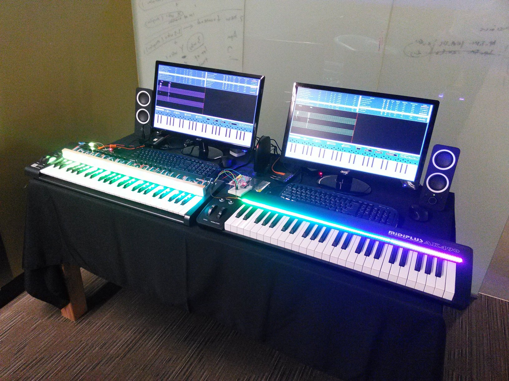
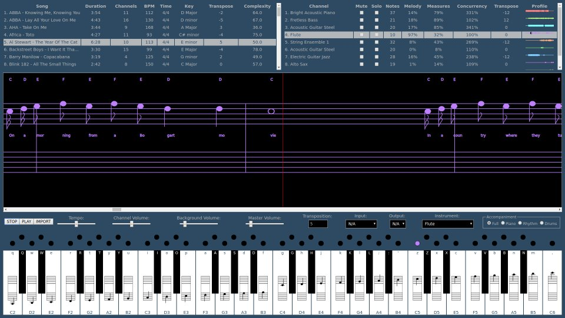
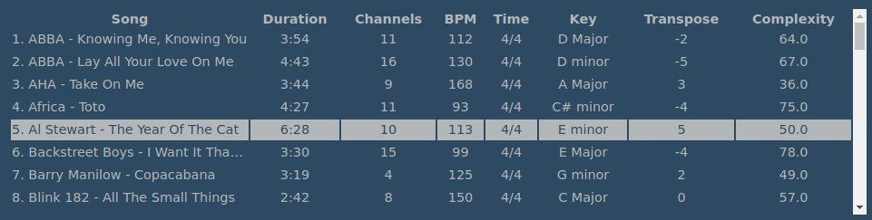
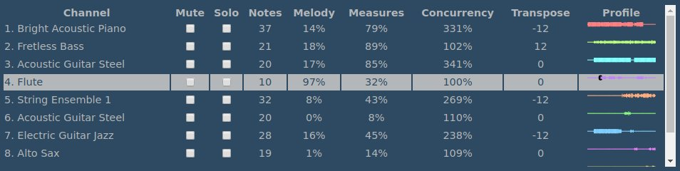
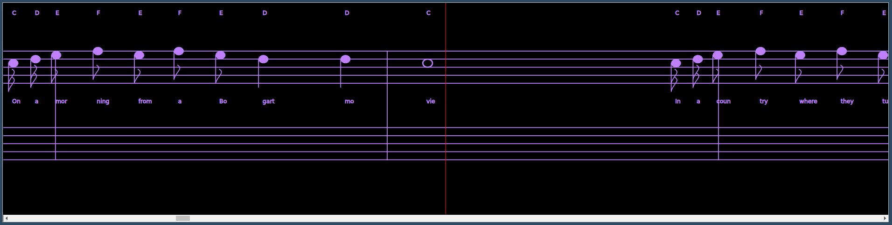
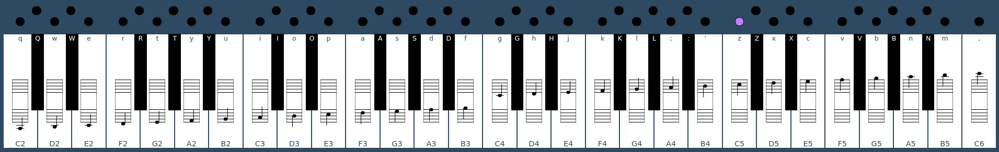
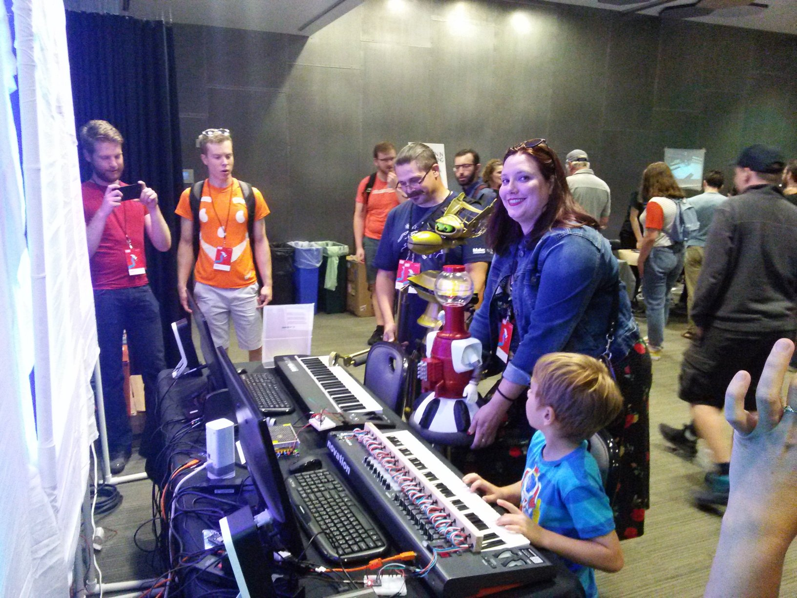

# Overview

Welcome to Musicianeer, the fourth generation in a line of music projects that includes Jamming with Color, Making Music While the Sun Shines and Karaoke Band.

With Musicianeer, you play a piano or MIDI keyboard that features an LED strip that shows you what keys to press, when to press them and how long to hold them.



# Features

Musicianeer features a server based application that you connect to using a standard browser. The main features include:

* MIDI Library Browser
* Channel / Part Selector
* Music Notator
* Playback Controls
* On-Screen Mini Piano Keyboard

Each of these features is described in more detail below.



# MIDI Library Browser

You begin by selecting a song from the MIDI library. Each row in the MIDI library includes:

* Song Title
* Duration
* Number of Channels
* Beats per Minute
* Time Signature
* Key Signature
* Complexity
* EZKey Transposition (to play on mainly the white keys)



# Channel / Part Selector

Once you've selected a song, you can then pick a channel. Channels generally represent the different parts, or instruments in the song. Each row in the channel selector includes:

* Number of unique notes in the part
* Percent of time the part plays the melody
* Percent of measures that the part is active
* Number of notes playing at one time (i.e. as chords)
* Graphical timeline showing where part is active in song
* Semitones to Transpose (to allow part to play on 49 key MIDI keyboard)
* Mute checkbox (to silence background for this part)
* Solo checkbox (to silence background for other parts)



# Music Notator

After you select a channel, the notes in the channel are displayed in conventional music notation in a window that scrolls horizontally as the song plays. This includes:

* Note / chord name above piano staff
* Note location and duration on piano staff
* Lyrics (if present) between bass and treble cleff
* Drum names for drum channel (channel 10)
* Scrollbar to view music and select a playback point



# Control Area

Below the music notator is the control area. It includes:

* Control Buttons
    * STOP (pause / stop playback)
    * PLAY (resume / start playback)
    * IMPORT (import MIDI file into MIDI library)
* Tempo Slider (slide this to the left to make the song easier to play)
* Channel Volume Slider (the volume of your instrument)
* Background Volume Slider (the volume of the background)
* Master volume Slider (the overall volument level)
* Semitones to transpose (transposes to white keys by default)
* MIDI input device (the keyboard associated with this browser session)
* MIDI output device (the LED strip associated with this browser session)
* Instrument (defaults to instrument for part, you can override with any of 128 general MIDI instruments)
* Type of accompaniment
    * Full (from the MIDI file itself)
    * Piano (maps all instruments to Acoustic Grand Piano)
    * Rhythm (just drums and bass guitars)
    * Drums (just drums).


# On-Screen Keyboard

The bottom part of the screen displays the on-screen keyboard. It features 49 keys, where each key displays:

* Note and octave
* Position of the note on the staff
* PC keyboard shortcut (if you don't have a piano or MIDI keyboard)

The keys on the on-screen keyboard are highlighted when you play them on the attached MIDI device.



# Installation

Musicianeer was developed for Linux and will run on a Raspberry Pi Model 3. You can build Musicianeer from the source code in this repository, or download a precompiled Raspberry Pi version from the releases tab.

It uses FluidSynth to convert the MIDI notes into sound. To install FluidSynth on a Raspberry Pi, open a shell window and enter the following command:

```
sudo apt-get install libfluidsynth-dev fluid-soundfont-gm
```

After you've installed FluidSynth, download the release zip file from github and unpack it in the pi home directory to create a folder called MusicPad.

Musicianeer uses either regular MIDI files or MIDI karaoke files. MIDI Karaoke files are MIDI files with song lyrics. They usually end with a .kar suffix. MIDI files differ from MP3 files in that MIDI files contain messages that represent the gestures of the musicianeer (e.g. note on, note off) whereas MP3 files contain a compressed representation of the resulting sound.

No MIDI files are included with Musicianeer, so use Google to search for midi karaoke files and download some to a handy place so that you can subsequently import them into Musicianeer using the IMPORT button.

# LED Strip

Musicianeer uses an external LED strip to show you what keys to press, when to press them, and when to release them.

Musicianeer includes a simple Arduino program to receive MIDI messages from the Musicianeer Server and turn on and off the appropriate LEDs. It uses a Pro Micro ATmega32U4 to drive the LED strip.

https://www.amazon.com/gp/product/B01MTU9GOB

One of the benefits of the Pro Micro is that it includes a builtin software controlled USB port that can be used with the MIDI library to make the Pro Micro look like a MIDI device to the Linux operating system.

You will also need a string of LEDs. Musicianeer provides sample programs for two types of LED strips: a string of 50 individually addressable WS2801 LEDs:

https://www.amazon.com/gp/product/B0192VUDNG

As well as a string of individually addressable SK9822 LEDs (which are similar to APA102C or WS2812B). 

https://www.amazon.com/gp/product/B07BPX2KFD

This LED strip is recommended because it features a self adhesive backing, which sticks easily to your keyboard. If you want, you can cut this LED strip to size. Be sure to cut the correct end. See the source for information on the number of LEDs it expects to control.

In addition, you will need a power supply to provide sufficient current for the LEDs.

The next step is to breadboard the Pro Micro, the connectors for the LED strip and the external power supply. This step assumes you have experience with safely building electronic circuits for use with the Arduino IDE. If you don't, consult another source before proceeding.

Although you may be tempted to connect the LED strip directly to the Pro Micro and skip the external power supply, the LEDs consume a lot of power and you risk burning out the Pro Micro. Also, be sure to connect the GND output of the power supply to the GND of the Pro Micro so that all components are at the same electrical potential.

If you've never used a Pro Micro ATmega32U4 with the Arduino IDE before, you'll need to install the Pro Micro board support for the Arduino IDE:

https://learn.sparkfun.com/tutorials/pro-micro--fio-v3-hookup-guide/all

Once the circuit is breadboarded, open a recent version of the Arduino IDE, load PianoBar-WS2801.ino or PianoBar-SK9822.ino (depending on which type of LEDs you have), configure the processor type (Tools -> Board) and port (Tools -> Port), and upload the sketch to the Pro Micro.

Be sure to configure the board before uploading the sketch because it is easy to brick the Pro Micro ATMega32u4 if you try to download to it as another board (e.g. an Arduino UNO). Fortunately, there are unbricking procedures available on the web. They work, but they require that you jumper pins at just right the moment during the Arduino upload process. It's much better not to have to do this.

Musicianeer also works without an LED strip. You can use the mock LEDs (filled circles) on the bottom part of the user interface to see which keys to press. These mock LEDs light up like the actual LEDs on the LED strip.

# Startup

To run Musicianeer, open a shell prompt / command line window and navigate to the MusicPad folder that was created when you unzipped the release image.

Then enter ./Musicianeer.bash to start the server.

Next, from a browser window, open the Musicianeer window. If you do this on the server, the address will be localhost.

```
http://localhost:8080/Musicianeer.html
```
From another client, you will need to replace localhost with the hostname or IP address of the server.

Musicianeer is designed to be used with multiple MIDI keyboards, with each player having their own keyboard and browser window. Use the Input field in the control area to associate a MIDI keyboard with a particular browser session.

Likewise, if you have a LED strip, use the Output selector to associate the browser session with a particular LED strip.

For best results, put your browser window into full screen mode (generally F11, or select from browser control menu).

# 2018 Seattle Mini Maker Faire

Hundreds of visitors got a chance to play with Musicianeer at the 2018 Seattle Mini Maker Faire.



https://seattle.makerfaire.com/maker/entry/480/

The demonstration consisted of:

* 2 Raspberry Pi Model 3s
* 2 Acer 22 inch monitors
* 2 49 Key MIDI keyboards
* 2 Custom LED bars
* 2 ATmega32u4 Pro Micros
* 2 Alphanumeric PC keyboards
* 2 Standard PC mice
* 2 Amplified PC speakers
* 1 Belkin wireless router

One of the Raspberry Pi's ran the Musicianeer software and a recent version of the Chrome browser. The other Raspberry Pi ran a Chrome browser connected to the Musicianeer server.

In addition, the demonstration included an LED lighting controller that demonstrates the use of Internet of Things (IoT) technologies to drive a number of innovative LED lighting effects.

When you press or release keys on the keyboard, the server publishes messages to topics on a Message Queue Telemetry Transport (MQTT) server. 


